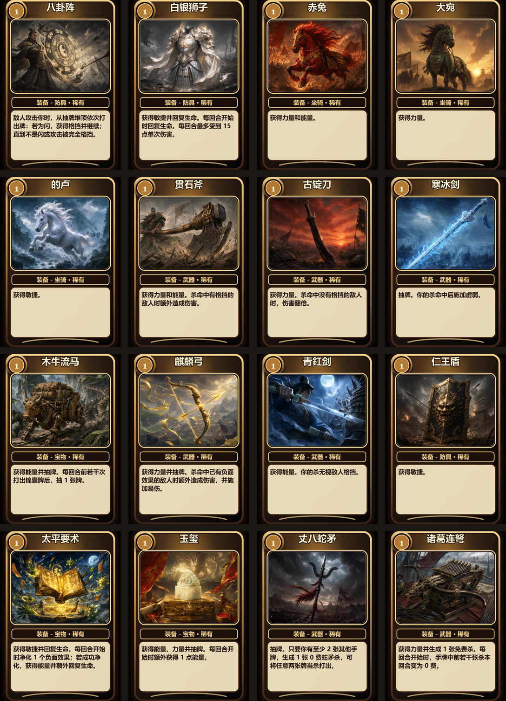
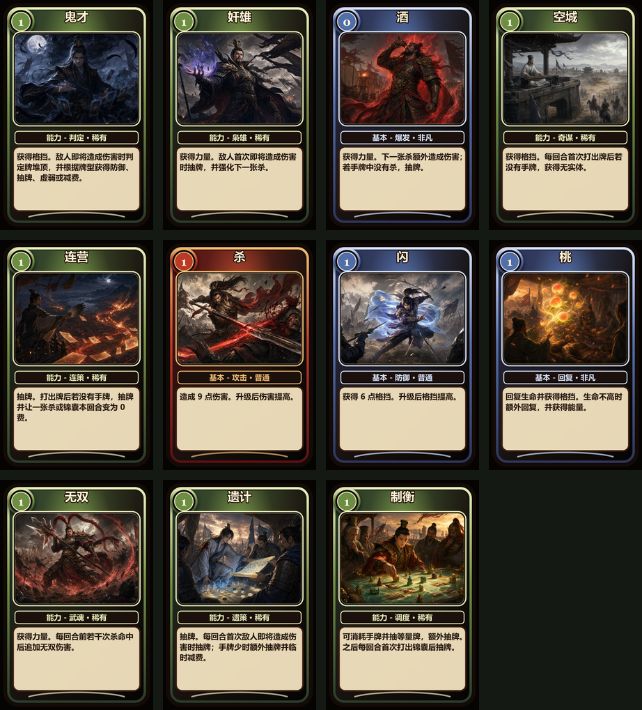
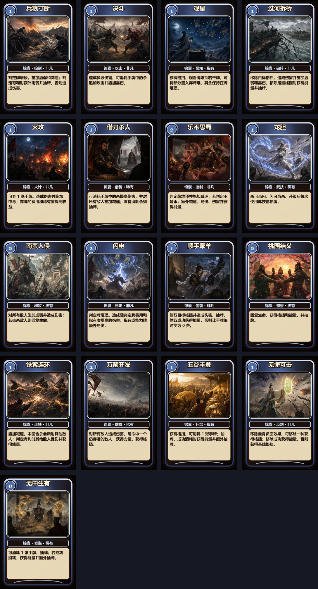

# SanguoshaMod

三国杀主题的 Slay the Spire 2 玩法模组。当前版本包含三国杀风格基础牌、攻击牌、技能牌、能力牌、装备牌、角色技能、初始遗物、卡牌插画、装备栏图标和中文本地化。

最新版本：[v0.1.6-multiplayer](https://github.com/FigureQAQ/SanguoshaMod/releases/tag/v0.1.6-multiplayer)

## 图片预览

| 装备牌 | 基础与能力牌 |
| --- | --- |
|  |  |

| 技能牌与锦囊牌 |
| --- |
|  |

后续要继续添加截图或宣传图，可以放到 `docs/images/`，然后在 README 中用相对路径引用：

```markdown

```

建议截图命名使用 `screenshot-combat-01.png`、`screenshot-card-reward-01.png` 这类稳定文件名，方便后续替换而不用改 README。

## 当前内容

- 75 张已导出的卡牌头像/牌面资源。
- 20 张装备牌，分为武器、防具、坐骑、宝物四个槽位；同槽位只能装备一件，新装备会顶掉旧装备并触发旧装备的“失去时”效果。
- 五个角色均有三国化命名、初始遗物和杀附魔机制。
- 每个角色的基础牌有独立角色风格，包含专属边框和能量样式。
- 卡牌头像来自 `card_art`，README 展示图来自 `docs/images`，装备栏图标来自 `power_icons` 与 `power_icons_big`。
- 依赖 `STS2-RitsuLib`，当前项目引用版本为 `0.3.6`。

## 联机安装

推荐所有联机玩家使用同一个 release 标签或同一份发布压缩包，避免卡池、数值和逻辑不一致。

1. 关闭 Slay the Spire 2。
2. 将发布包解压到 Slay the Spire 2 游戏根目录。
3. 解压后应得到 `mods\sanguosha` 和 `mods\STS2-RitsuLib` 两个文件夹。
4. 如果已经有 `STS2-RitsuLib`，覆盖同名文件夹即可，不要保留两个 `STS2-RitsuLib`，否则游戏会报重复模组 id。
5. 联机玩家需要使用同一份压缩包内容。

## 本地构建

1. 复制 `local.props.example` 为 `local.props`。
2. 将 `Sts2Dir` 改为本机 Slay the Spire 2 安装路径。
3. 构建：

```powershell
& 'C:\Program Files\dotnet\dotnet.exe' build .\SanguoshaMod.csproj -c Release --no-restore
```

构建目标会把 DLL、manifest、本地化文件、卡牌头像和装备图标复制到配置的 `mods\sanguosha` 目录。

## 卡牌资源生成

```powershell
npm run cardgen:all
```

该命令会重新生成牌面预览、游戏头像和 `card_art/cards.generated.json`。

常用单项命令：

```powershell
npm run cardgen
npm run cardgen:core
npm run cardgen:tricks
npm run cardgen:role-basic
npm run cardgen:export
```

## 文档

- 装备说明：`docs/EQUIPMENT_CARDS_2026-05-29.md`
- 角色附魔：`docs/CHARACTER_INFUSIONS_2026-05-29.md`
- 平衡记录：`docs/BALANCE_PASS_2026-05-30.md`
- 杀附魔节奏：`docs/SHA_INFUSION_BALANCE_2026-05-29.md`
- 仁王盾重做：`docs/REN_WANG_REWORK_2026-05-29.md`
- 机关卧龙星辉修正：`docs/DEFECT_THUNDER_STARS_FIX_2026-05-29.md`
- RitsuLib 升级记录：`docs/RITSULIB_UPGRADE_2026-05-29.md`
- 实现审计：`docs/IMPLEMENTATION_AUDIT_2026-05-30.md`
