# SanguoshaMod

三国杀主题的 Slay the Spire 2 玩法模组。它把「杀、闪、桃、酒」、装备槽位、角色武魂和三国式技能牌接入 STS2 的战斗节奏里，并为五个角色制作了专属基础牌卡面、边框和能量样式。

[最新 Release：v0.1.6-multiplayer](https://github.com/FigureQAQ/SanguoshaMod/releases/tag/v0.1.6-multiplayer)

## 卡牌预览

这些图片来自模组的完整牌面渲染，包含实际使用的卡框、费用、类型栏和正文布局。

### 角色基础牌

| 火杀 | 毒杀 | 雷杀 | 灾厄杀 | 储能杀 |
| --- | --- | --- | --- | --- |
| 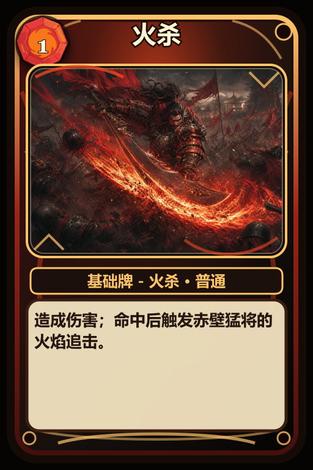 | 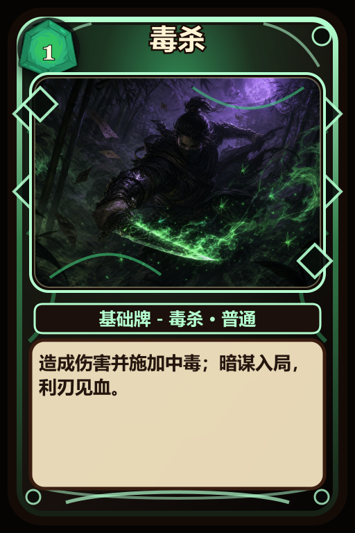 | 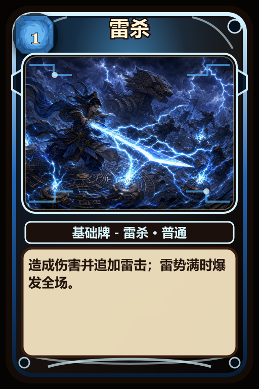 | 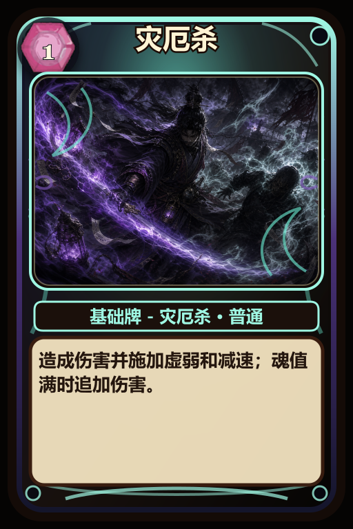 | 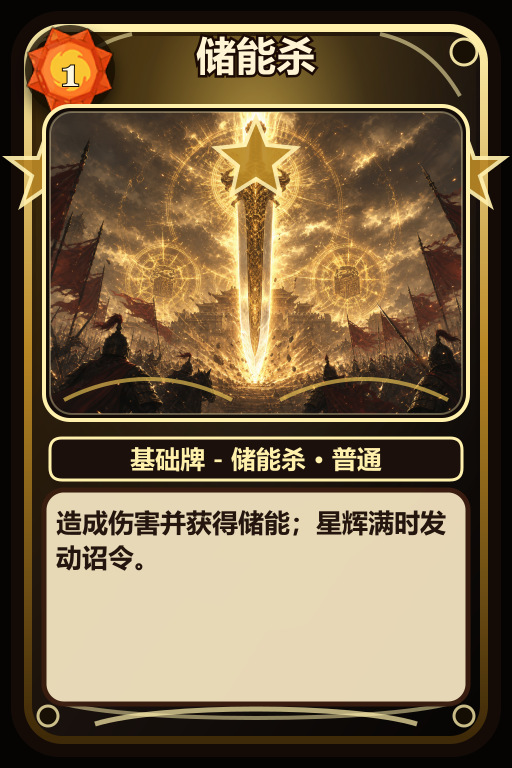 |

### 技能牌

| 突袭 | 奇袭 | 顺手牵羊 |
| --- | --- | --- |
| 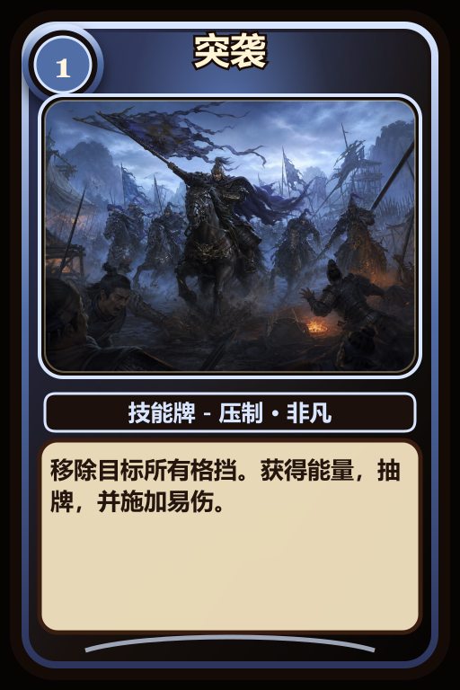 | 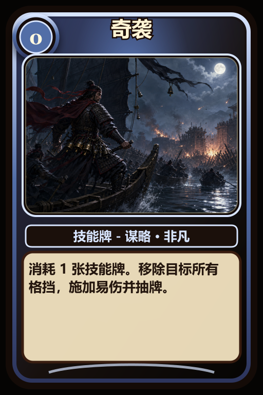 | 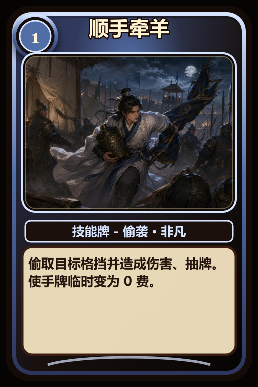 |

### 装备牌

| 赤兔 | 大宛 | 绝影 | 孟德新书 |
| --- | --- | --- | --- |
| 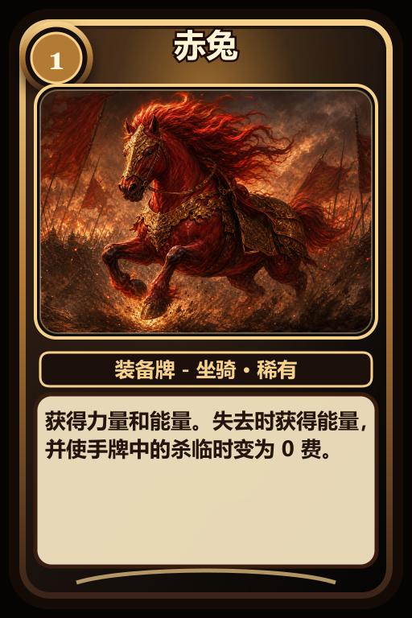 | 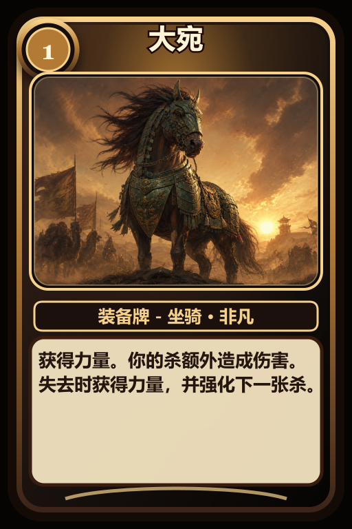 | 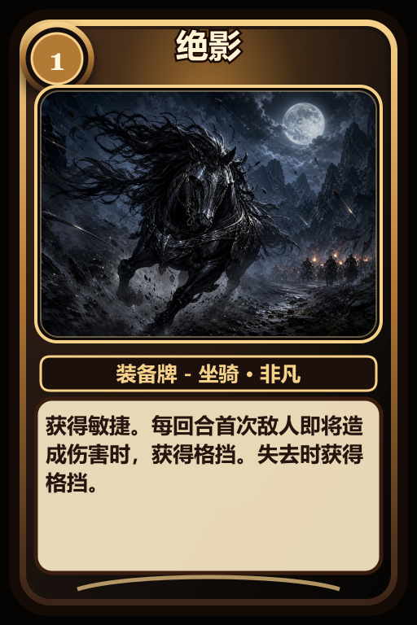 | 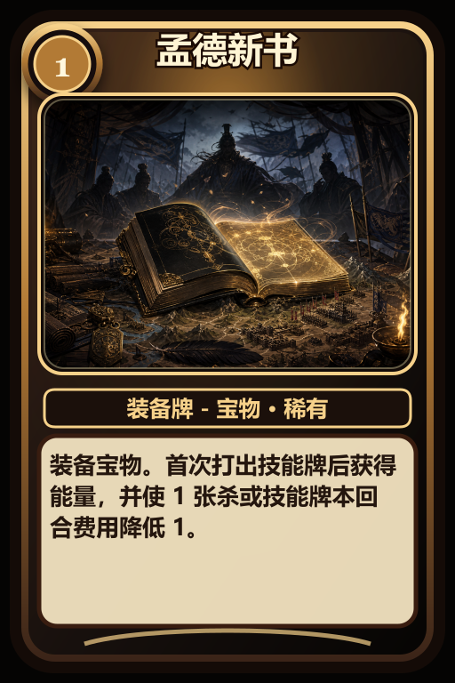 |

完整卡池预览：

| 装备牌 | 基础/能力/扩展牌 |
| --- | --- |
|  |  |

| 技能牌 |
| --- |
|  |

## 玩法内容

- `75` 张已导出的卡牌头像和牌面资源。
- 基础牌包括「杀、闪、桃、酒」，并为五个角色绘制了不同风格的角色基础牌。
- 攻击牌、技能牌、能力牌和装备牌都已接入游戏卡池。
- 装备牌分为武器、防具、坐骑、宝物四个槽位；同槽位只能装备一件，新装备会顶掉旧装备并触发旧装备的失去效果。
- 五个角色拥有三国化命名、初始遗物和杀附魔机制。
- 卡牌头像来自 `card_art`，完整牌面预览来自 `docs/images`，装备栏图标来自 `power_icons` 与 `power_icons_big`。
- 依赖 `STS2-RitsuLib`，当前项目引用版本为 `0.3.6`。

## 角色特色

| 角色 | 杀附魔 | 核心节奏 |
| --- | --- | --- |
| 赤壁猛将 | 火杀 | 追加火焰伤害，低生命时爆发更高。 |
| 锦囊夜行 | 毒杀 | 叠中毒，攻击中毒敌人时获得额外节奏。 |
| 机关卧龙 | 雷杀 | 连锁电击并积累雷势，满层后爆发全体伤害。 |
| 青囊魂医 | 灾厄杀 | 用治疗、魂值和灾厄压制敌人。 |
| 汉室仁主 | 储能杀 | 用号令、星辉和储能把单牌收益转成团队节奏。 |

## 联机安装

推荐所有联机玩家使用同一个 release 标签或同一份发布压缩包，避免卡池、数值和逻辑不一致。

1. 关闭 Slay the Spire 2。
2. 将发布包解压到 Slay the Spire 2 游戏根目录。
3. 解压后应得到 `mods\sanguosha` 和 `mods\STS2-RitsuLib` 两个文件夹。
4. 如果已经有 `STS2-RitsuLib`，覆盖同名文件夹即可，不要保留两个 `STS2-RitsuLib`，否则游戏会报重复模组 id。
5. 联机玩家需要使用同一份压缩包内容。

## 本地构建

1. 复制 `local.props.example` 为 `local.props`。
2. 将 `Sts2Dir` 改为本机 Slay the Spire 2 安装路径。
3. 构建：

```powershell
& 'C:\Program Files\dotnet\dotnet.exe' build .\SanguoshaMod.csproj -c Release --no-restore
```

构建目标会把 DLL、manifest、本地化文件、卡牌头像和装备图标复制到配置的 `mods\sanguosha` 目录。

## 卡牌资源生成

```powershell
npm run cardgen:all
```

该命令会重新生成牌面预览、游戏头像和 `card_art/cards.generated.json`。

常用单项命令：

```powershell
npm run cardgen
npm run cardgen:core
npm run cardgen:tricks
npm run cardgen:role-basic
npm run cardgen:export
```

要继续给 README 添加图片，请把完整牌面或截图放到 `docs/images/` 或 `docs/images/cards/`，再用相对路径引用：

```markdown

```

## 文档

- 装备说明：`docs/EQUIPMENT_CARDS_2026-05-29.md`
- 角色附魔：`docs/CHARACTER_INFUSIONS_2026-05-29.md`
- 平衡记录：`docs/BALANCE_PASS_2026-05-30.md`
- 杀附魔节奏：`docs/SHA_INFUSION_BALANCE_2026-05-29.md`
- 仁王盾重做：`docs/REN_WANG_REWORK_2026-05-29.md`
- 机关卧龙星辉修正：`docs/DEFECT_THUNDER_STARS_FIX_2026-05-29.md`
- RitsuLib 升级记录：`docs/RITSULIB_UPGRADE_2026-05-29.md`
- 实现审计：`docs/IMPLEMENTATION_AUDIT_2026-05-30.md`
