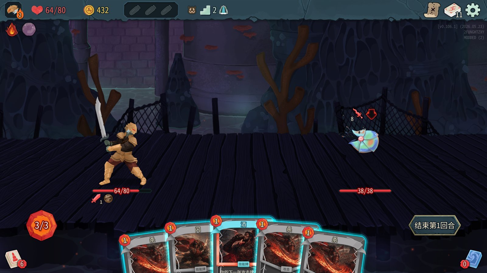
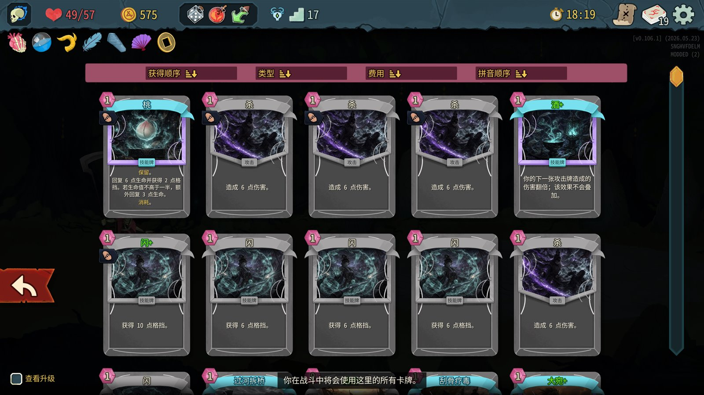
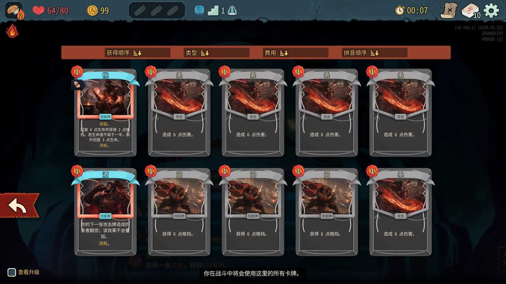
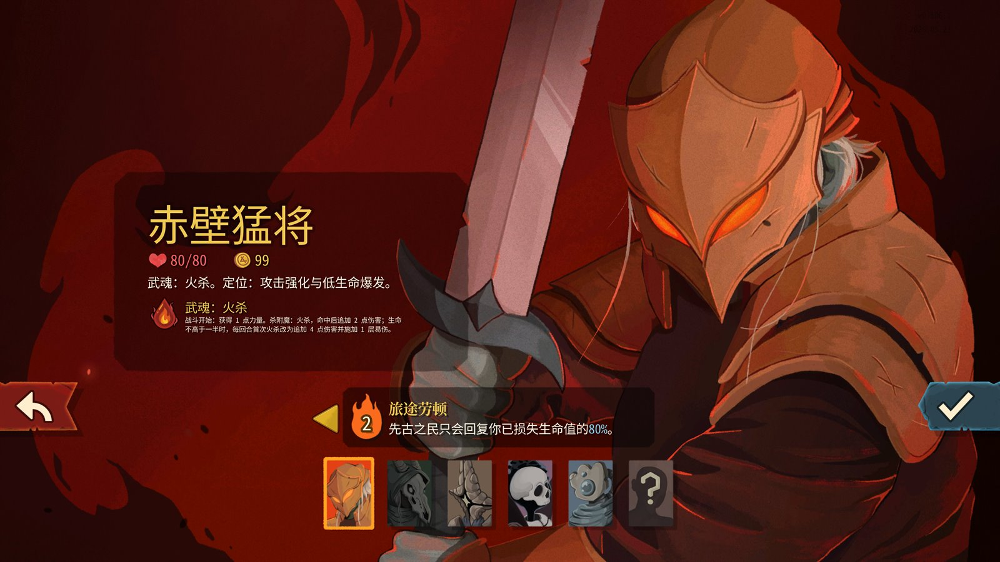
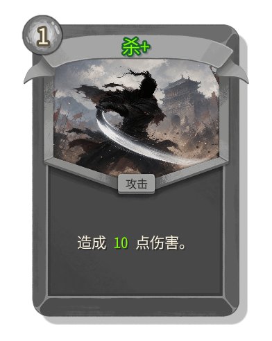
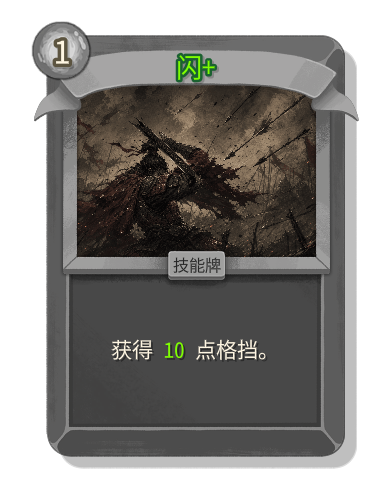
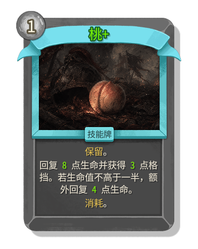
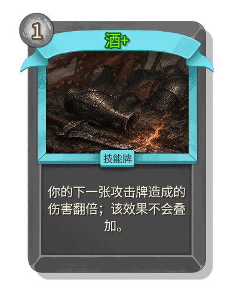
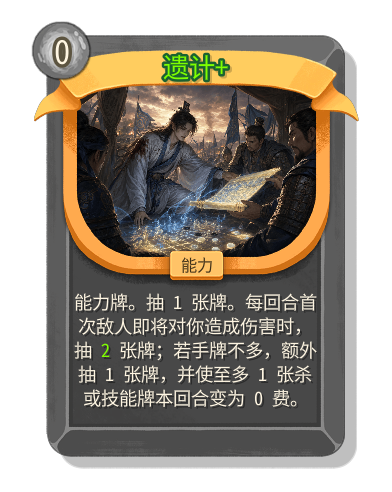
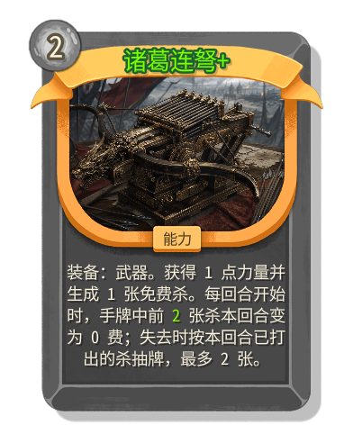

# SanguoshaMod

三国杀主题的 Slay the Spire 2 玩法模组。模组将“杀、闪、桃、酒”、装备槽位、角色杀附魔和三国式技能牌接入 STS2 的战斗节奏，并为不同角色准备了专属基础牌图、卡牌边框和能量样式。

当前开发版本：`0.2.0`，最低支持 STS2 `0.109.0`。

## 游戏内截图

README 展示图只使用游戏内真实截图或从真实截图裁切出的卡牌，不再使用离线工具生成的完整卡面预览。









### 升级卡牌样式

| 杀+ | 闪+ | 桃+ | 酒+ | 遗计+ | 诸葛连弩+ |
| --- | --- | --- | --- | --- | --- |
|  |  |  |  |  |  |

## 玩法内容

- 基础牌包括“杀、闪、桃、酒”，并为五个角色绘制不同风格的角色基础牌。
- 攻击牌、技能牌、能力牌和装备牌已接入游戏卡池。
- 装备牌分为武器、防具、坐骑、宝物四个槽位；同槽位只保留一件，新装备会顶掉旧装备并正确移除旧装备提供的属性。
- 五个角色拥有三国化命名；属性杀机制以初始遗物形式提供，并驱动各自的杀附魔机制。
- 依赖 `STS2-RitsuLib`，当前项目与运行时均使用稳定版 `0.4.60`。

### 0.2.0 简洁联动型牌组

- 新增 35 张牌：10 张角色专属起始牌、10 张共享奖励牌、15 张角色专属奖励牌。
- 普通牌以单一基础效果构筑骨架，罕见牌负责条件转换，稀有牌负责每回合有限次数的规则改变。
- 五名角色分别围绕失血、毒、雷势、治疗/消耗、交替牌型与辉星形成三条可组合路线。
- 每名角色的新开局会在通用替换后加入恰好两张专属起始牌；这些牌不会进入普通奖励和商店。
- 方天画戟、刚烈、闭月、狂风、断肠、颂威均有独立持续状态图标。

#### 新增共享牌

| 普通 | 罕见 | 稀有 |
| --- | --- | --- |
| 强袭、烈弓、天义、草船借箭、以逸待劳、知己知彼 | 驱虎、火烧连营、水淹七军 | 方天画戟 |

#### 新增角色牌

| 角色 | 起始牌 | 奖励牌 |
| --- | --- | --- |
| 赤壁猛将 | 赤锋、血守 | 咆哮、武圣、刚烈 |
| 锦囊夜行 | 毒刃、潜行 | 离间、奇策、闭月 |
| 机关卧龙 | 雷引、机甲 | 雷击、看破、狂风 |
| 青囊魂医 | 药刃、护魂 | 急救、活墨、断肠 |
| 汉室仁主 | 号令、守汉 | 激将、谦冲、颂威 |

## 卡牌设计

这个模组不是把官方卡牌简单改名为三国杀，而是把原版 STS2 的攻击、防御、技能、能力和遗物节奏重新映射到三国杀的牌义上。

### 基础牌

| 卡牌 | 类型定位 | 当前设计 |
| --- | --- | --- |
| 杀 | 攻击牌 | 1 费造成 6 点伤害，升级后 10 点。所有角色的初始遗物都会把杀转化为自己的属性杀节奏。 |
| 闪 | 技能牌 | 1 费获得 6 点格挡，升级后 10 点。它替代官方防御牌的基础职责，同时参与八卦阵、事件和遗物兼容。 |
| 桃 | 技能牌 | 保留并消耗，回复生命并给少量格挡；半血以下额外治疗。定位是保命牌，不是单纯的防御牌。 |
| 酒 | 技能牌 | 使下一张攻击牌伤害翻倍；基础版消耗，升级后移除消耗。它是爆发回合的启动牌，不再提供力量、抽牌和免费杀的复合收益。 |

五个角色的杀、闪、桃、酒使用不同卡图、边框和能量样式。它们在规则上保持同一套基础牌逻辑，但在视觉上会表达各自角色身份。

### 属性杀

角色不再只依赖官方的角色专属打击牌，而是通过初始遗物把所有杀接入不同的附魔路线。

| 角色 | 属性杀 | 设计区别 |
| --- | --- | --- |
| 赤壁猛将 | 火杀 | 战斗开始获得力量，杀命中后追加火焰伤害。 |
| 锦囊夜行 | 毒杀 | 战斗开始抽牌；杀命中施加中毒，每回合首次技能牌抽牌。 |
| 机关卧龙 | 雷杀 | 杀命中积累雷势并追加雷击，雷势满 4 后释放群体伤害。 |
| 青囊魂医 | 灾厄杀 | 杀命中施加灾厄；打出闪时所有敌人失去生命。 |
| 汉室仁主 | 君王之剑 | 战斗开始获得辉星；杀命中后锻造原版君王之剑，使用悬剑 UI 并提高悬剑伤害。 |

这些属性杀仍被系统视为“杀”，因此能和武器、酒、无双、丈八蛇矛、事件和兼容补丁共同工作。

### 技能牌与锦囊

README 和游戏内文案统一使用“技能牌”称呼原本的锦囊/技巧类卡牌。它们大多不是官方技能牌的直接替换，而是围绕三国杀的牌义重做：

- 决斗、借刀杀人会真实消耗手牌中的杀来换取额外段数或追加伤害。
- 兵粮寸断、乐不思蜀、闪电使用随机数奇偶做延迟判定；铁索连环保留杀的溅射联动。
- 过河拆桥、顺手牵羊、突袭、奇袭围绕格挡、减费、抽牌和易伤做区分，避免所有牌都变成“目标没格挡时更强”。
- 无中生有、五谷丰登、桃园结义保留资源调度感，但控制抽牌、能量和团队收益，降低联机滚雪球风险。

### 能力牌

能力牌承接武将技能，例如空城、龙胆、制衡、无双、连营、遗计、奸雄、鬼才。它们不占装备槽，也不会顶掉武器、防具、坐骑或宝物。

这些牌更接近“长期改变角色打法”的官方能力牌，但触发条件按三国杀语义设计：空城强调下回合无实体和不能出攻击牌，龙胆让每回合第一张杀或闪免费，遗计和奸雄围绕受伤前的抽牌与反击收益。

### 装备牌

装备牌是本模组和官方卡池区别最大的系统之一。官方装备通常表现为能力、遗物或临时数值，本模组把三国杀装备拆成四个明确槽位：

| 槽位 | 示例 | 玩法定位 |
| --- | --- | --- |
| 武器 | 诸葛连弩、丈八蛇矛、青釭剑、古锭刀、干将莫邪 | 强化杀、生成杀、追加伤害或改变杀的费用。 |
| 防具 | 八卦阵、仁王盾、白银狮子、藤甲 | 改变防御方式，提供格挡、治疗、减伤或判定闪。 |
| 坐骑 | 赤兔、大宛、的卢、绝影 | 提供进攻节奏、敏捷或回合级防御。 |
| 宝物 | 玉玺、木牛流马、太平要术、孟德新书 | 管理能量、抽牌、净化和技能牌联动。 |

同槽位只能保留一件装备。新装备会顶掉旧装备，并触发旧装备的“失去时”效果；因此换装本身也是战斗决策，而不是单纯覆盖数值。

## 与官方卡牌的区别

| 维度 | 官方 STS2 | SanguoshaMod |
| --- | --- | --- |
| 初始牌组 | 以角色自己的打击、防御和少量特色牌开局。 | 以杀、闪、桃、酒为共同语言，再由初始遗物改变杀的属性和收益。 |
| 防御牌 | 防御通常只是获得格挡，和角色关键词联动。 | 闪既是基础格挡牌，也是八卦阵、事件、遗物兼容和部分技能的判断对象。 |
| 攻击成长 | 主要通过攻击牌升级、力量、易伤和角色机制成长。 | 杀会被武器、酒、无双、属性杀和装备槽共同放大，但多数强触发有每回合限制。 |
| 技能牌 | 多数围绕抽牌、减费、格挡、生成牌或角色资源。 | 技能牌承载锦囊语义，加入消耗手牌中的杀、转移或移除效果、团队收益等三国杀式互动。 |
| 能力牌 | 长期改变角色循环或增加触发器。 | 能力牌对应武将技能，不占装备槽，强调杀/闪/技能牌之间的长期规则变化。 |
| 装备系统 | 装备感通常由能力、遗物或单张牌效果表达。 | 有武器、防具、坐骑、宝物四槽；同槽替换会移除旧属性并触发失去效果。 |
| 视觉表达 | 主要沿用官方职业颜色、卡框和能量风格。 | 每个角色拥有专属基础牌图、卡牌边框和能量样式，README 只展示真实游戏内渲染。 |
| 联机稳定 | 官方卡池天然同步。 | 自定义卡池需要限制无限连、免费牌和追加伤害链；模组用每回合上限和兼容补丁降低同步风险。 |

设计目标是保留 STS2 的回合制构筑、能量管理和卡牌稀有度框架，同时把关键决策改成三国杀风格：什么时候出杀、怎么留闪、是否用桃保命、酒交给哪张攻击牌、换装是否值得触发旧装备的失去效果。

## 角色特色

| 角色 | 初始遗物 / 杀附魔 | 核心节奏 |
| --- | --- | --- |
| 赤壁猛将 | 火杀 | 战斗开始获得力量，杀命中追加火焰伤害。 |
| 锦囊夜行 | 毒杀 | 杀施加中毒，每回合首次技能牌抽牌。 |
| 机关卧龙 | 雷杀 | 杀追加雷击并积累雷势，满层后爆发全体伤害。 |
| 青囊魂医 | 灾厄杀 | 用治疗、闪和灾厄压制敌人。 |
| 汉室仁主 | 君王之剑 | 依靠辉星和杀命中锻造原版悬剑，让君王之剑持续成长。 |

## 联机安装

推荐所有联机玩家使用同一个 release 标签或同一份发布压缩包，避免卡池、数值和逻辑不一致。

1. 关闭 Slay the Spire 2。
2. 将发布包解压到 Slay the Spire 2 游戏根目录。
3. 解压后应得到 `mods\sanguosha` 和 `mods\STS2-RitsuLib` 两个文件夹。
4. 如果已经有 `STS2-RitsuLib`，覆盖同名文件夹即可，不要保留两个 `STS2-RitsuLib`，否则游戏会报重复模组 id。
5. 联机玩家需要使用同一份压缩包内容。

## 本地构建

1. 复制 `local.props.example` 为 `local.props`。
2. 将 `Sts2Dir` 改为本机 Slay the Spire 2 安装路径。
3. 构建：

```powershell
& 'C:\Program Files\dotnet\dotnet.exe' build .\SanguoshaMod.csproj -c Release --no-restore
```

构建目标会把 DLL、manifest、卡牌头像和装备图标复制到配置的 `mods\sanguosha` 目录。运行时中文文本由 DLL 内的本地化补丁提供。

## 卡牌资源生成

离线资源生成命令：

```powershell
npm run cardgen:all
```

常用单项命令：

```powershell
npm run cardgen
npm run cardgen:core
npm run cardgen:tricks
npm run cardgen:role-basic
npm run cardgen:export
```

这些命令生成的是开发用卡图、卡面预览和导出资源，不等同于游戏内真实卡牌渲染。不要直接把工具生成的完整牌面预览作为 GitHub README 的游戏截图。

## 添加真实截图

继续给 README 添加图片时，请把游戏内真实截图放到 `docs/images/real-game/`，再用相对路径引用。

推荐截图内容：

- 战斗中的手牌截图，能看到不同角色边框和能量样式。
- 卡牌奖励或牌库截图，能看到技能牌、能力牌和装备牌分类。
- 角色基础牌截图，能看到杀、闪、桃、酒和属性杀的真实游戏内样式。

## 文档

以下文档文件名保留创建日期，列表中的更新时间按当前仓库文件时间同步。

- 装备说明：`docs/EQUIPMENT_CARDS_2026-05-29.md`（更新：2026-05-30 19:07）
- 角色附魔：`docs/CHARACTER_INFUSIONS_2026-05-29.md`（更新：2026-05-30 19:07）
- 平衡记录：`docs/BALANCE_PASS_2026-05-30.md`（更新：2026-05-30 19:07）
- 杀附魔节奏：`docs/SHA_INFUSION_BALANCE_2026-05-29.md`（更新：2026-05-30 19:07）
- 仁王盾重做：`docs/REN_WANG_REWORK_2026-05-29.md`（更新：2026-05-30 19:07）
- 机关卧龙星辉修正：`docs/DEFECT_THUNDER_STARS_FIX_2026-05-29.md`（更新：2026-05-30 19:07）
- RitsuLib 升级记录：`docs/RITSULIB_UPGRADE_2026-05-29.md`（更新：2026-05-31 10:35）
- 实现审计：`docs/IMPLEMENTATION_AUDIT_2026-05-30.md`（更新：2026-05-30 19:07）
- 0.2.0 发布检查：`docs/VERSION_0.2.0_RELEASE_CHECK_2026-07-20.md`
